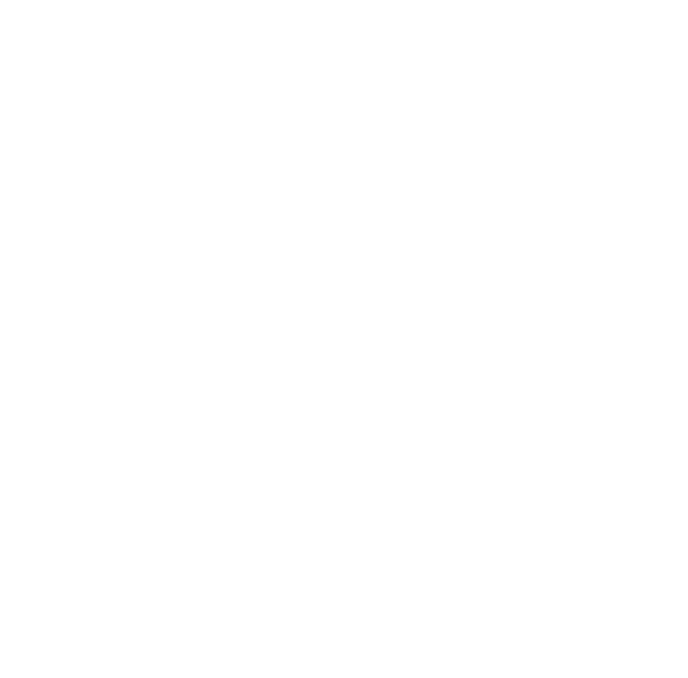

# ranimontagna.com

<div align="center">
  </img>
</div>

🌟 **Portfólio pessoal de Ranielli Montagna** - Um site moderno e responsivo desenvolvido com Next.js 16, apresentando projetos, experiências e habilidades como Full Stack Developer.


## ✨ Características

- 🌍 **Multilíngue**: Suporte completo para Português, Inglês e Espanhol
- 🎨 **Design Moderno**: Interface clean e responsiva com Tailwind CSS
- ⚡ **Performance**: Otimizado com Turbopack e Next.js 16
- 🎭 **Animações**: Transições suaves com Motion (anteriormente Framer Motion)
- 📱 **Mobile First**: Totalmente responsivo para todos os dispositivos
- 🔍 **SEO Otimizado**: Meta tags e estrutura otimizada para motores de busca
- ♿ **Acessibilidade**: Desenvolvido seguindo padrões de acessibilidade
- 🧪 **Testado**: Cobertura de testes com Vitest e Testing Library
- 🚀 **Bun**: Package manager ultra-rápido para instalação e execução
- 🎯 **Biome**: Linter e formatter moderno e extremamente rápido

## 🛠️ Tecnologias

### Core

- **Next.js 16.0.10** - Framework React com App Router e Turbopack
- **React 19.2.3** - Biblioteca para interfaces de usuário
- **TypeScript 5.x** - Superset tipado do JavaScript
- **Tailwind CSS 4.x** - Framework CSS utilitário

### Bibliotecas

- **next-intl 4.3.6** - Internacionalização
- **Motion 12.23.12** - Animações e transições
- **Lucide React 0.561.0** - Ícones modernos

### Ferramentas de Desenvolvimento

- **Bun** - Package manager e runtime JavaScript ultrarrápido
- **Biome 2.3.9** - Linter e formatter moderno e rápido
- **Vitest 4.0.16** - Framework de testes
- **Testing Library** - Testes de componentes React

## 🚀 Começando

### Pré-requisitos

- **Node.js** 20.9.0 ou superior (requerido pelo Next.js 16)
- **Bun** (recomendado e configurado neste projeto)

### Instalação

1. **Clone o repositório**

   ```bash
   git clone https://github.com/RanielliMontagna/ranimontagna.com.git
   cd ranimontagna.com
   ```

2. **Instale as dependências**

   ```bash
   bun install
   ```

3. **Execute o servidor de desenvolvimento**

   ```bash
   bun dev
   ```

4. **Abra no navegador**

   Acesse [http://localhost:3000](http://localhost:3000) para ver o resultado.

### Scripts Disponíveis

```bash
# Desenvolvimento com Turbopack
bun dev

# Build para produção
bun run build

# Executar versão de produção
bun start

# Linting com Biome
bun run lint

# Formatação de código com Biome
bun run format

# Lint e format ao mesmo tempo (recomendado)
bun run check

# Executar testes
bun test

# Testes com cobertura
bun run test:coverage

# Lighthouse CI (performance)
bun run lighthouse:local
```

## 📁 Estrutura do Projeto

```
src/
├── app/                    # App Router do Next.js
│   └── [locale]/          # Rotas internacionalizadas
├── components/            # Componentes reutilizáveis
│   ├── animations/        # Componentes de animação
│   ├── footer/           # Footer do site
│   ├── header/           # Header com navegação
│   └── languageSwitcher/ # Seletor de idioma
├── containers/           # Containers de páginas
│   └── home/            # Container da página inicial
│       └── sections/    # Seções da home
├── contexts/            # Context providers
├── i18n/               # Configuração de internacionalização
└── tests/              # Configuração de testes

messages/               # Traduções
├── en.json            # Inglês
├── es.json            # Espanhol
└── pt.json            # Português

public/                # Arquivos estáticos
├── cv/               # Currículos em PDF
├── companies/        # Logos das empresas
└── logo/            # Logo do site
```

## 🌍 Internacionalização

O site suporta três idiomas:

- 🇧🇷 **Português (BR)** - Idioma padrão
- 🇺🇸 **Inglês (US)**
- 🇪🇸 **Espanhol (ES)**

As traduções estão localizadas na pasta `messages/` e são gerenciadas pelo `next-intl`.

## 🎨 Seções do Portfólio

- **Hero**: Apresentação inicial com call-to-actions
- **Sobre**: Informações pessoais e profissionais
- **Experiência**: Histórico profissional e habilidades
- **Projetos**: Showcase dos principais projetos
- **Contato**: Formulário e informações de contato

## 🧪 Testes

O projeto utiliza Vitest para testes unitários e de componentes:

```bash
# Executar todos os testes
bun test

# Executar testes com cobertura
bun run test:coverage

# Executar testes em modo watch
bun test --watch
```

## 📄 Licença

Este projeto é destinado ao portfólio pessoal de Ranielli Montagna.

Desenvolvido com ❤️ por [Ranielli Montagna](https://github.com/RanielliMontagna)
