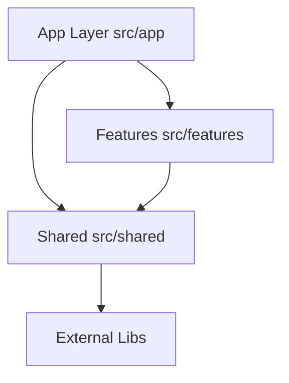

# Project Architecture

The project follows a **Feature-Based Architecture**, designed to be scalable, maintainable, and easy to navigate. This architecture segments code by business domain (features) rather than technical type (controllers, views, etc.).

## Core Concepts

### 1. Features (`src/features/`)
Features are self-contained modules that represent a specific business domain or route sections. Each feature should ideally work in isolation.

- **Examples**: `home`, `projects`, `blog`.
- **Structure**: Each feature folder contains everything it needs: components, hooks, libs, types, and localized data.
- **Rules**:
  - Features should not import from other features directly (unless necessary, but prefer moving shared logic to `shared`).
  - Features export their public API via an `index.ts` file.

### 2. Shared Kernel (`src/shared/`)
Contains code that is reused across multiple features or is generic enough to not belong to a specific domain.

- **Examples**: `ui` components (buttons, inputs), `layout` (header, footer), `lib` (utils, constants), `config` (i18n).
- **Rules**:
  - Code here must be highly reusable and agnostic of specific feature logic.
  - Dependencies should flow **towards** shared (Features -> Shared). Shared should never import from Features.

### 3. Application Layer (`src/app/`)
Uses Next.js App Router for routing and entry points.

- **Role**: This layer is thin. It primarily composes features and handles routing logic.
- **Rules**:
  - Avoid complex business logic here. Delegate to features.
  - Connects features to the routing system.

## Dependency Flow



## Directory Structure Overview

```
src/
├── app/              # Next.js App Router
├── features/         # Business domains
│   ├── home/
│   ├── projects/
│   └── blog/
├── shared/           # Shared utilities & UI
│   ├── components/
│   ├── lib/
│   ├── config/
│   ├── services/
│   └── store/
└── tests/            # Global test setup
```
